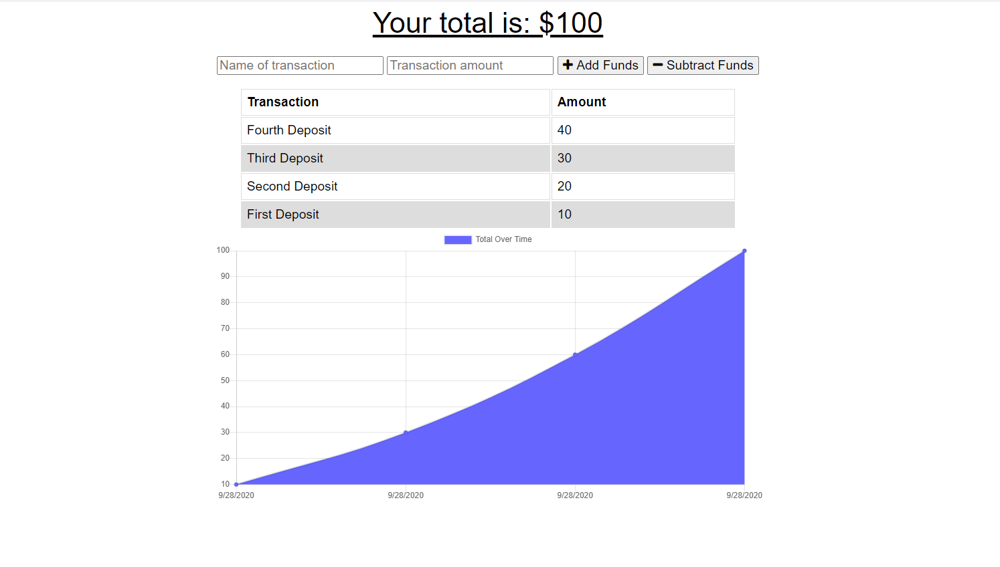

# Budget Tracker   
## Description

A demonstrative app to track you budget. Mostly conceptual on how to used indexedDB, Service Worker, and Manifest.json tools.

## Table of Contents

* [Installation](#installation)
* [Usage](#usage)
* [License](#license)
* [Contributing](#contributing)
* [Tests](#tests)
* [Questions](#questions)

## Installation

Clone the repo, run 'npm i'. Most functionality requires that the app be deployed. Use the heroku link (https://morning-cliffs-07835.herokuapp.com/) or deploy yourself.

## Usage

Track your budget! Withdrawls and Deposits. Know where your money is going. Use the app offline, and when you go back online it will be updated! Download the PWA to your computer or mobile device.

## License

No License!

## Contributing

Contribute at will!

## Tests

No tests available

## Questions

If you have any questions, please contact me via [email](vinnycar0923@gmail.com) or on [Github](http://github.com/vcaruso0923).

## Screenshot

